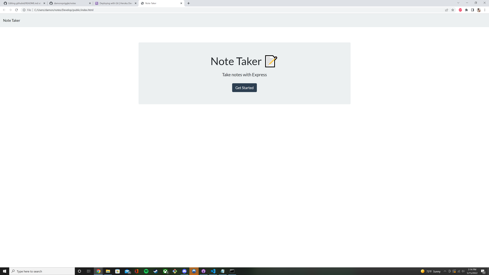

-- NOTE TAKER APP --
Unit 11 homework

Project Description

This project is a application run in Node using command-line-input. It generates a HTML file displaying information entered in. NPM must be installed.

The user is asked if they want to add notes. They can add notes as they please. 

Example

Techniques and Technologies Used
This app was created using Object-Oriented Programming concepts, namely using express and heroku. The app is run using Node.js, and uses the "Inquirer" and "FS" node modules. This also uses Express.Files for different objects are also stored in separate .js files and passed among one another using module.exports and require.

This app was created using Node.js (Inquirer and FS modules), Javascript and html.
This app was uploaded to heroku.
This app uses concepts from Test-Driven Development such as Jest and HTML.
